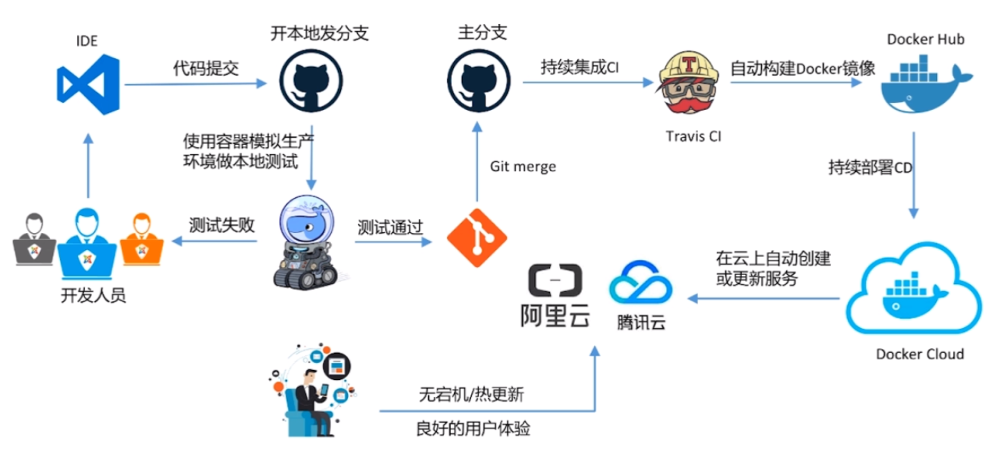

### 流程图概况



### 容器技术概况

部署发展历史 ——

### 阶段1：物理服务器直接部署APP

#### 缺点 ——

#### 1.部署慢

要在物理服务器上安装操作系统，安装APP。

#### 2.成本高

要购买物理服务器

#### 3.资源浪费

CPU和内存不饱和

#### 4.难于迁移和扩展

#### 5.可能会被限定硬件产商

SUM和X86互不兼容

### 阶段2：虚拟化技术的出现

在物理服务器上，通过Hypervisor做物理技术的虚拟化。虚拟化，可以实现物理资源的限定和调度。从而实现，一个物理机可以部署多个app、每个app独立运行在一个VM中。

#### 1.资源池

一个物理机的资源分配到不同虚拟机中

#### 2.容易扩展

加物理机器或虚拟机

#### 3.容易云化

#### 局限性 ——

每个虚拟机都是完整的操作系统，要给它分配资源。当虚拟机数量增多时，操作系统本身小号的资源势必增多。

### 阶段3：容器

避免开发和运维人员，因环境不一致导致冲突。开发和运维之间搭建了一个桥梁，是实现devops的最佳解决方案。

#### 什么是容器？

1.对软件和依赖的标准化打包

2.应用之间相互隔离

3.共享同一个OS Kernel

4.可以运行在很多主流操作系统上

#### 容器、虚拟化

容器是APP层面的隔离，虚拟化是物理资源层面的隔离。

#### Docker

docker，容器技术的一种实现。

### docker安装

#### 安装virtualBox 和vagrant

0.安装virtual box

注意版本兼容，目前vagrant尚不支持virtualBox6.1版本！

1.安装vagrant, 然后打开git bash,创建各种目录

```
mkdir Vagrant
cd Vagrant
mkdir centos7
cd centos7
```

2.安装centos/7

```
vagrant init centos/7
vagrant up
```

3.安装完毕之后，打开virtualbox，发现虚拟机已经在运行。

#### 安装docker

1.启动vagrant

```
vagrant up
```

连接虚拟机

```
vagrant ssh
```

2.清除原有的docker，然后安装docker相关的依赖，详细过程请见官方文档 <https://docs.docker.com/install/linux/docker-ce/centos/>

option的安装可以跳过！

3.进入INSTALL DOCKER ENGINE - COMMUNITY的部分

```
sudo yum install docker-ce docker-ce-cli containerd.io
```

4.启动docker

```
sudo systemctl start docker
```

5.验证docker是否启动

```
sudo docker version
```

或者

```
sudo docker run hello-world
```

